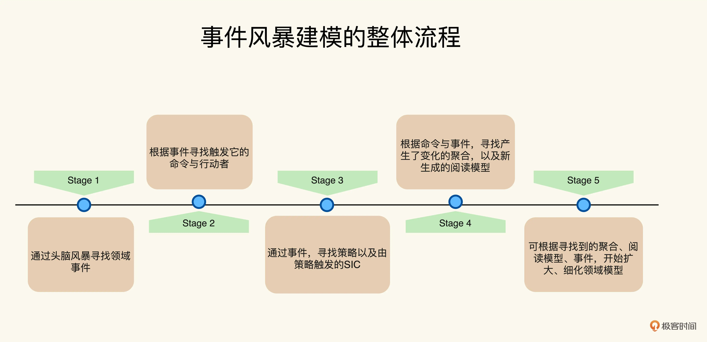

定义问题后  
如何有效定义问题  

使用易于实现的模型解决问题  

才能解决问题  
领域模型  
统一语言 商品：包含商品信息，不包含库存信息， 库存：包含商品信息和库存数量  

模型  
修改代码等于修改模型，修改模型等于修改统一语言。  

催化剂建模  

记叙文六要素：时间，地点，人物，起因，经过和结果  

事件建模法：  
原则1：通过事件表示交互  
通过 记叙文六要素寻找领域概念  

原则2：通过时间线划分不同事件
领域事件是指：发生在领域中值得注意的事件，而领域事件通常意味着领域对象状态的改变（对象状态的改变），
能引起领域对象变更的就是领域事件，否则就是交互事件  

关于业务颗粒度问题：引入多条领域事件时间线

事件风暴：  
（行动者）Actors：  
（命令）Command：   
（事件）Event：包含了时间，地点，人物，起因，经过和结果  
（聚集）Aggregate：指代领域驱动设计中的聚合，可以看作一组领域对象，在头脑风暴阶段，可以泛指某些领域概念，不需要细化  
（系统）System：指代不需要了解细节的第三方系统，可以看作一个整体  
（阅读模型）ReadModel：以支撑决策信息，通常与界面布局有关  
（Policy）策略：对于事件的响应，通常表示不属于某些聚集逻辑。通过策略可以触发新的命令，而策略触发的命令，    
                被称作系统触发命令（SIC System Initiated Command） 

流程：
1.通过头脑风暴寻找领域事件
2.根据事件寻找触发它的命令和行动者
3.通过事件，寻找策略以及由策略触发的SIC
4.根据命令和事件，寻找产生变化的聚合，以及新生成的阅读模型
5.根据寻找的聚合根，阅读模型，事件，开始完善，细化领域模型  

